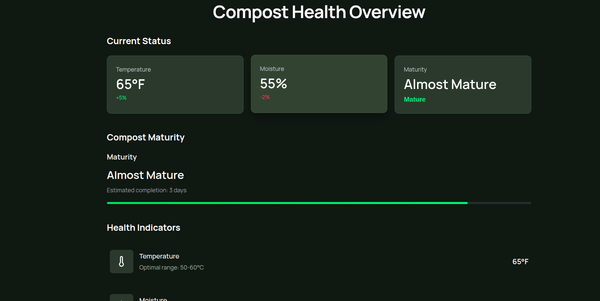
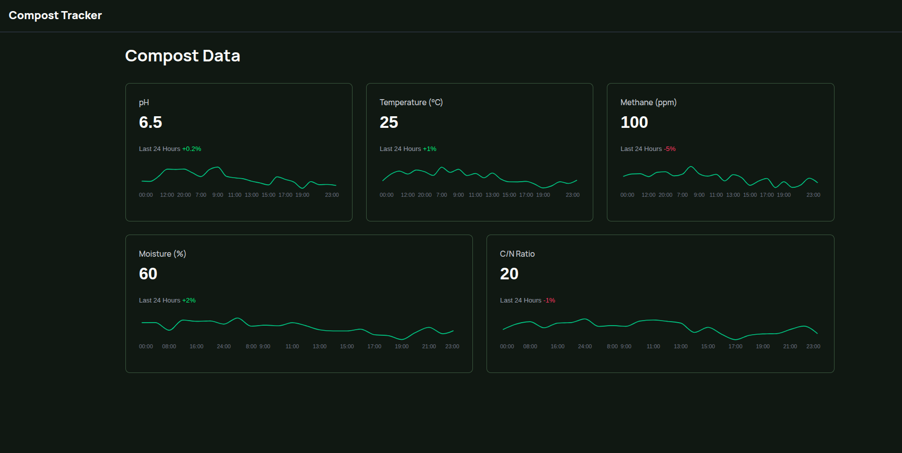

# 🌱 Smart Composting Bin – Frontend  

Turn waste into insights 🌍  

This project is the **frontend application** for the **Smart Composting Bin** system.  
It provides an intuitive and interactive dashboard that allows users to:  
- Monitor their composting bins  
- Visualize trends  
- Track eco-impact and efficiency  

Built with **Next.js** for performance and **Recharts** for rich data visualization.  

---

## ✨ Features  

- 📊 **Dashboard Analytics** – Visualize compost weight, temperature, and humidity.  
- 🗓️ **History Tracking** – View past composting data with filters.  
- ⚡ **Real-time Updates** – Pulls fresh data from backend APIs.  
- 🎨 **Responsive UI** – Optimized for mobile and desktop.  
- 🔍 **Insights & Trends** – Show composting efficiency and eco-impact.  

---

## 🛠️ Tech Stack  

- **Framework:** [Next.js](https://nextjs.org/)  
- **Charts & Graphs:** [Recharts](https://recharts.org/)  
- **Styling:** [Tailwind CSS](https://tailwindcss.com/)  
- **State Management:** React Hooks / Context API  
- **API Integration:** Smart Composting Bin backend API  

---

## 🚀 Getting Started  

### 1. Clone the repository  
```bash
git clone https://github.com/your-username/smart-compost-fe.git
cd smart-compost-fe
````

### 2. Install dependencies

```bash
npm install
# or
yarn install
```

### 3. Run the development server

```bash
npm run dev
# or
yarn dev
```

Now open [http://localhost:3000](http://localhost:3000) in your browser.

---

## 📸 Screenshots

### Dashboard Overview



### Compost History




---

## 📂 Project Structure

```
public/ # Static assets available at /
├── compost-bin.jpeg # Sample compost bin image
├── default-profile.jpg # Default profile picture
├── globe.svg # Icon assets
├── next.svg
├── vercel.svg
└── window.svg

src/app/ # Next.js 13 app directory
├── components/ # Reusable UI components
│ └── MetricCard.tsx # Card component for displaying metrics
├── context/ # React Context providers (state management)
├── dashboard/ # Dashboard page (analytics & charts)
├── history/ # History page (past compost data)
├── login/ # Login page
├── utils/ # Helper functions
├── globals.css # Global styles
├── layout.tsx # Root layout (applies across pages)
└── page.tsx # Main landing page
```


